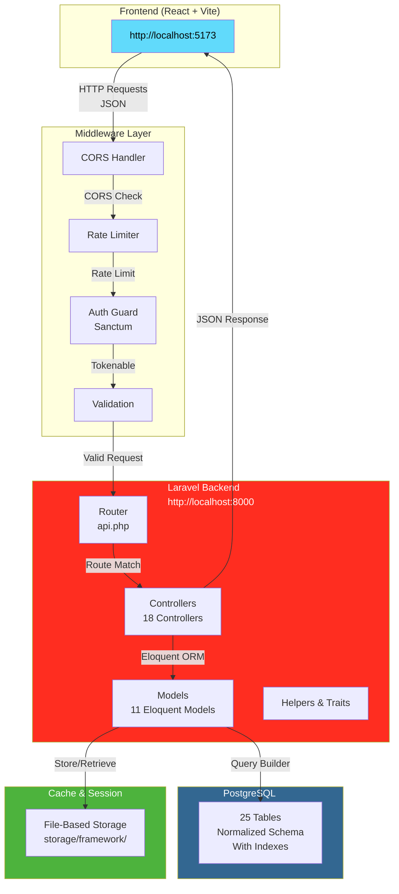
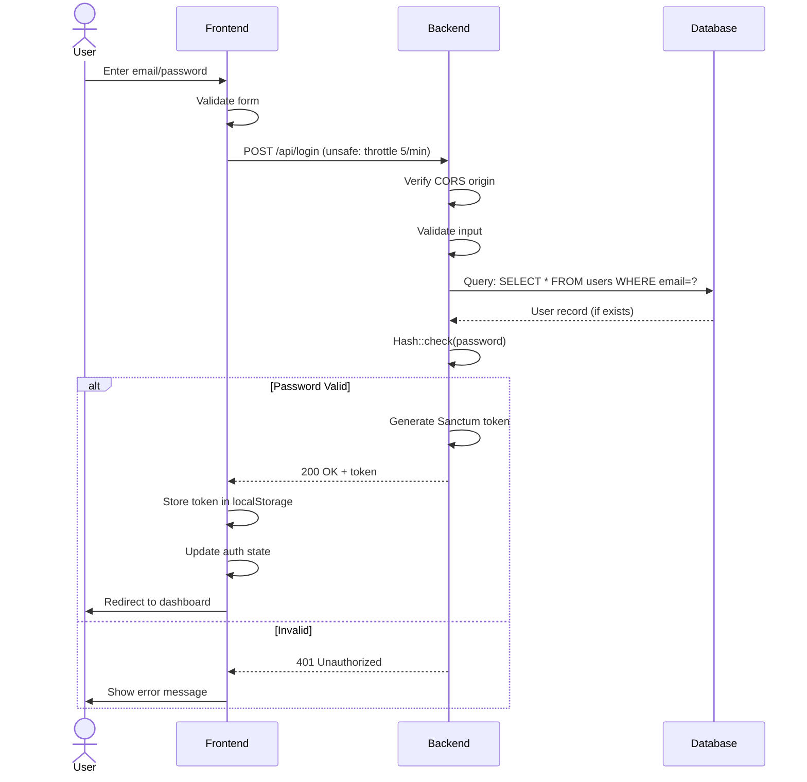
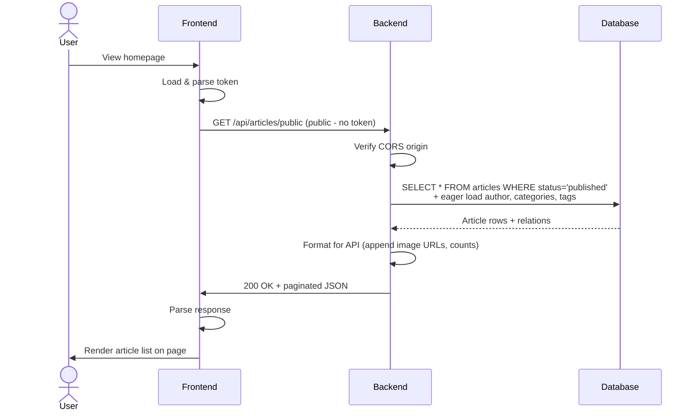
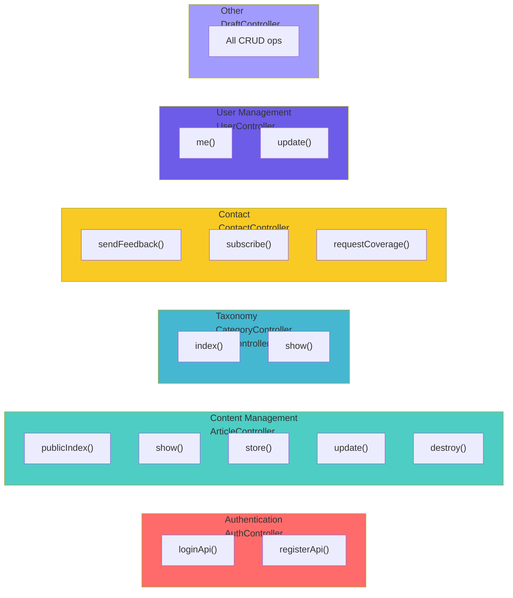
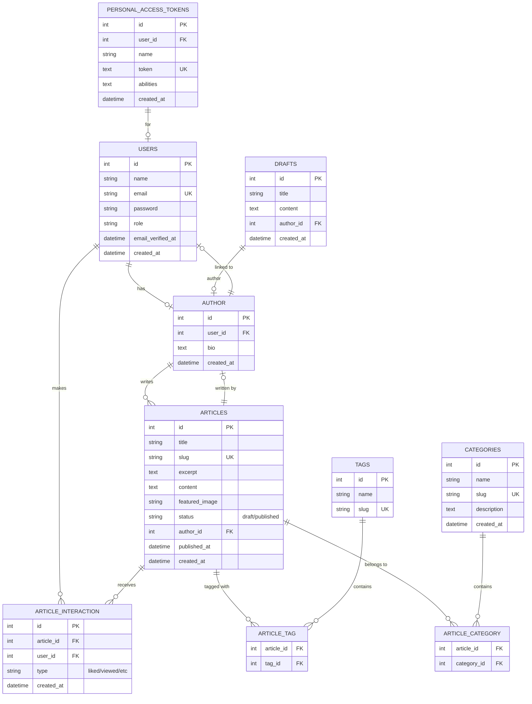
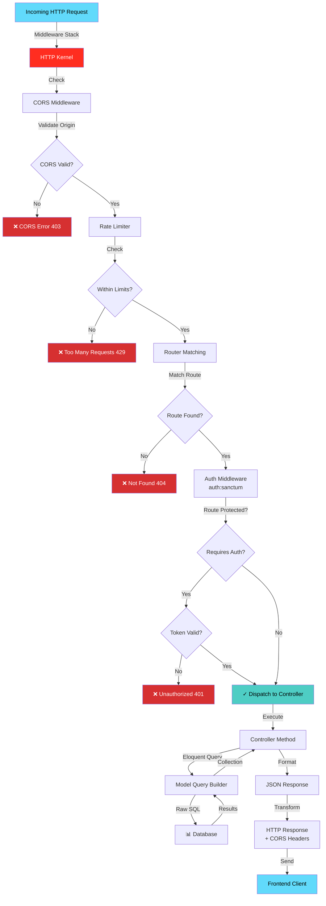

# Backend Architecture Diagrams

## System Architecture



## Data Flow - Login



## Data Flow - Fetch Articles



## Controller Responsibility Map



## Database Entity Relationship



## API Route Hierarchy

```mermaid
graph TB
    ROOT["API Root<br/>/api"]
    
    AUTH["Authentication<br/>Throttle: 5/min<br/>Public"]
    AUTH -->|POST| LOGIN["/login"]
    AUTH -->|POST| REGISTER["/register"]
    AUTH -->|GET| VERIFY["/email/verify/{id}/{hash}"]
    
    CONTENT["Content - Public Read"]
    CONTENT -->|GET| ARTICLES["/articles/public<br/>Paginated"]
    CONTENT -->|GET| ARTICLE_ID["/articles/{id}"]
    CONTENT -->|GET| SEARCH["/articles/search?q=<br/>Min 3 chars"]
    CONTENT -->|GET| CATEGORIES["/categories<br/>14 categories"]
    CONTENT -->|GET| TAGS["/tags"]
    CONTENT -->|GET| AUTHORS["/authors"]
    
    CONTACT["Contact - Rate Limited"]
    CONTACT -->|Throttle: 5/min| JOIN["/contact/join-herald"]
    CONTACT -->|Throttle: 10/min| FEEDBACK["/contact/feedback"]
    CONTACT -->|Throttle: 10/min| SUBSCRIBE["/contact/subscribe"]
    CONTACT -->|Throttle: 5/min| COVERAGE["/contact/request-coverage"]
    
    PROTECTED["Protected - Auth Required"]
    PROTECTED -->|GET/PUT| ME["/me<br/>Current User"]
    PROTECTED -->|GET/POST<br/>PUT/DELETE| DRAFTS["/drafts<br/>User Drafts"]
    PROTECTED -->|POST<br/>PUT/DELETE| MYARTICLES["/articles<br/>User Articles"]
    PROTECTED -->|POST| TEAM["/team-members/update"]
    
    ADMIN["Admin Only"]
    ADMIN -->|GET| USERS["/users"]
    ADMIN -->|GET| LOGS["/logs"]
    ADMIN -->|GET/POST<br/>PUT/DELETE| STAFF["/staff"]
    
    ROOT --> AUTH
    ROOT --> CONTENT
    ROOT --> CONTACT
    ROOT --> PROTECTED
    ROOT --> ADMIN
    
    style ROOT fill:#ff2d20,color:#fff
    style AUTH fill:#ff6b6b,color:#fff
    style CONTENT fill:#4ecdc4,color:#fff
    style CONTACT fill:#f9ca24,color:#000
    style PROTECTED fill:#a29bfe,color:#fff
    style ADMIN fill:#ff7675,color:#fff
```



## Request Processing Pipeline



## Authentication Flow - Token Based

```mermaid
graph LR
    subgraph Client["Frontend<br/>localStorage"]
        TOKEN["🔑 Auth Token<br/>JWT"]
    end
    
    subgraph Backend["Backend<br/>Session"]
        SANCTUM["Sanctum Guard"]
        PAT["Personal Access<br/>Tokens Table"]
    end
    
    subgraph Database["PostgreSQL"]
        TOKENS_TABLE["personal_access_tokens<br/>token UNIQUE<br/>tokenable_id<br/>abilities"]
    end
    
    STEP1["1. Login POST /api/login"]
    STEP2["2. Verify Credentials"]
    STEP3["3. Create Token"]
    STEP4["4. Return Token"]
    STEP5["5. Store in localStorage"]
    STEP6["6. Send Authorization Header"]
    STEP7["7. Validate Token"]
    STEP8["8. Check Abilities"]
    STEP9["9. Grant Access"]
    
    STEP1 --> STEP2
    STEP2 --> STEP3 --> STEP4 --> Client
    Client --> STEP5 --> STEP6 --> Backend
    STEP6 --> STEP7 --> PAT --> TOKENS_TABLE
    TOKENS_TABLE --> STEP8 --> STEP9
    
    style Client fill:#61dafb,color:#000
    style Backend fill:#ff2d20,color:#fff
    style Database fill:#336791,color:#fff
```



## File Structure - Key Paths

```
backend/
├── 📁 app/Http/Controllers/        ← Request handlers (18 files)
│   ├── ArticleController.php       
│   ├── AuthController.php
│   └── ... (18 total)
│
├── 📁 app/Models/                  ← Database models (11 files)
│   ├── Article.php
│   ├── User.php
│   └── ... (11 total)
│
├── 📁 routes/
│   └── api.php                     ← 80+ API endpoints (503 lines)
│
├── 📁 config/
│   ├── cors.php                    ← CORS configuration
│   ├── auth.php                    ← Authentication setup
│   ├── session.php                 ← Session config
│   └── database.php                ← DB connection
│
├── 📁 database/migrations/         ← 25 migrations
│   ├── create_users_table.php
│   ├── create_articles_table.php
│   └── ... (create schema)
│
├── 📁 storage/
│   ├── logs/                       ← laravel.log
│   └── framework/                  ← Sessions & cache
│
├── .env                            ← Local environment
├── Procfile                        ← Render deployment
├── docker-compose.yml              ← Local Docker setup
└── composer.json                   ← Dependencies
```

---

Created: February 10, 2026  
Framework: Laravel 12  
Database: PostgreSQL / Render  
Status: Production Ready
